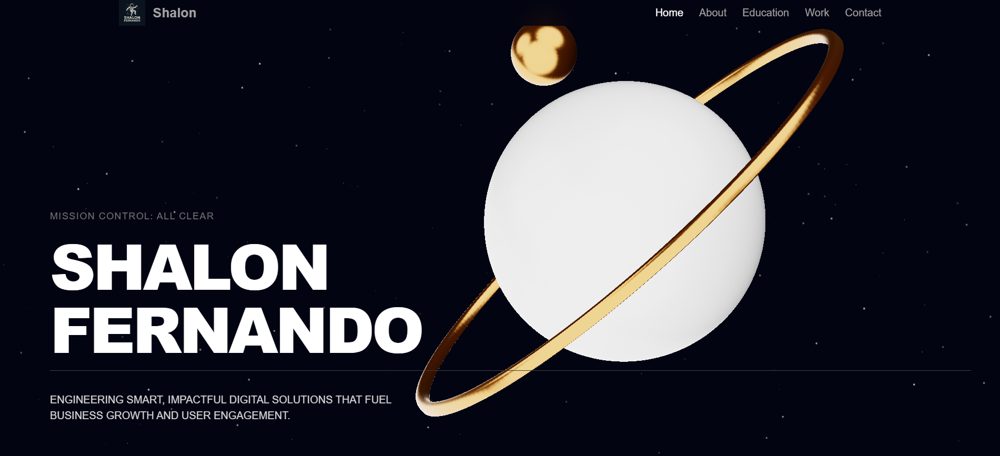

# Hi there, I'm Shalon Fernando

3rd Year 1st Semester undergraduate at SLIIT 
B.Sc. Hons. in Information Technology Specializing in Software Engineering 

---

# Check out my space themed Portfolio

  

P.S. Tap the image to view my full portfolio

---

## 🧠 About Me

- Full-stack developer building web, mobile, and intelligent systems
- Tech Stack: Spring boot, Java, Kotlin, Python, PHP, MERN, HTML/CSS  
- Always learning and building  
- Reach me at: [shalonfernando52@gmail.com](mailto:shalonfernando52@gmail.com)
- Check out my cv [View my Resume (PDF)](./Assets/ShalonFernandoResume.pdf)

---

## 📊 GitHub Stats

  
  

---

## 🛠️ Languages and Tools

<!--   
  
  
  
  
  
  
  
  
   -->

           <!-- Web Technologies -->       <!-- Mobile & UI -->    <!-- Tools & Platforms -->       <!-- Databases -->    <!-- Design Tools -->   

---

---

## 🏆 Holopin Board

---

### Latest Blog posts:

  <table style="width:100%; border-collapse:collapse;">
    <tr>
      <td style="width:160px; vertical-align:top; padding-right:12px;">
        
      </td>
      <td style="vertical-align:top;">
        <a target="_blank" href="https://medium.com/@shalonfernando52/wso2-api-manager-solving-api-calamity-in-modern-enterprises-6fe457001cb0" style="text-decoration:none; color:inherit;">
          <strong style="font-size:18px;">WSO2 API Manager — Solving API Calamity in Modern Enterprises</strong>
        </a>
        
Read on Medium

        <!-- Optional short excerpt could go here -->
      </td>
    </tr>
  </table>

